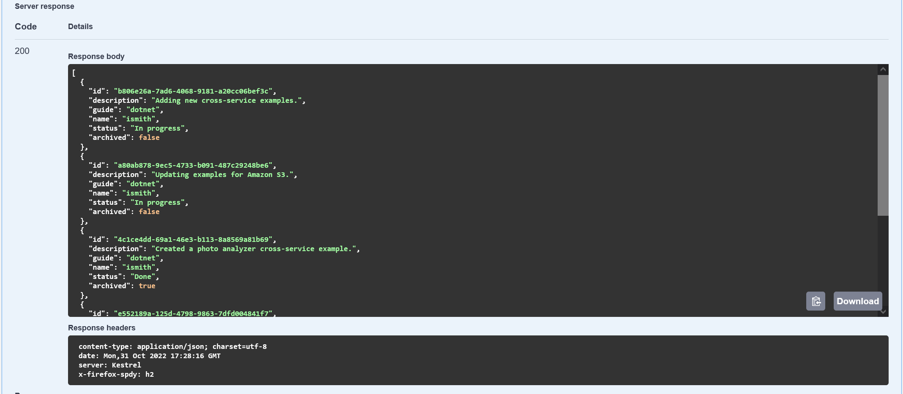
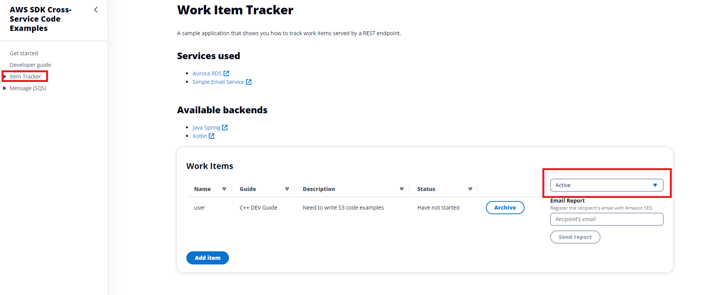
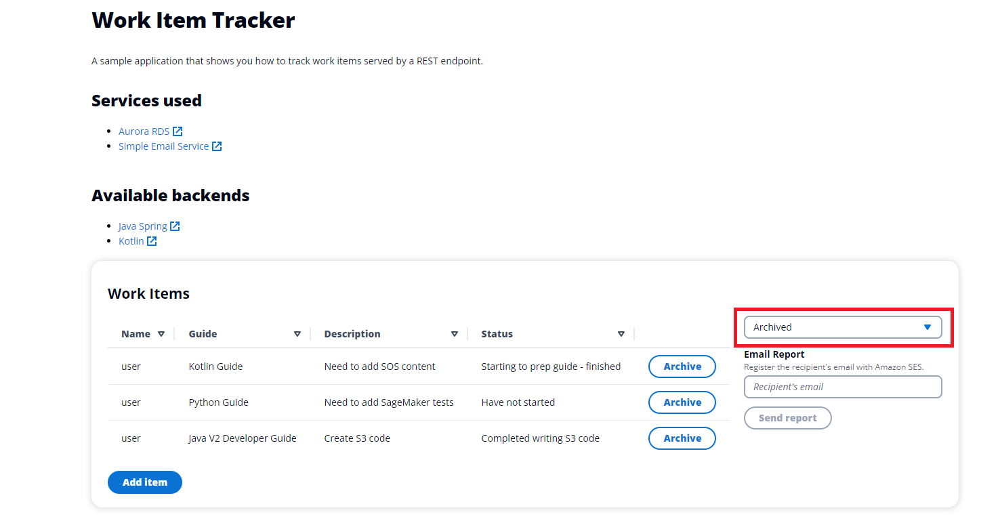
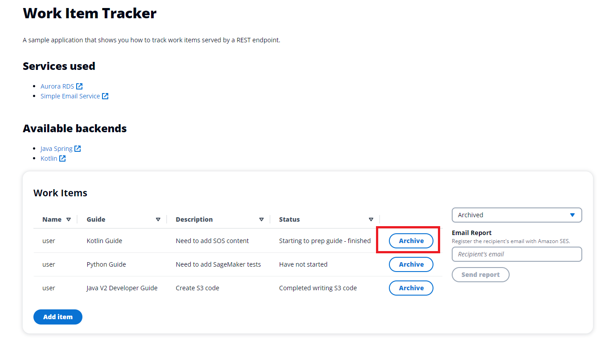
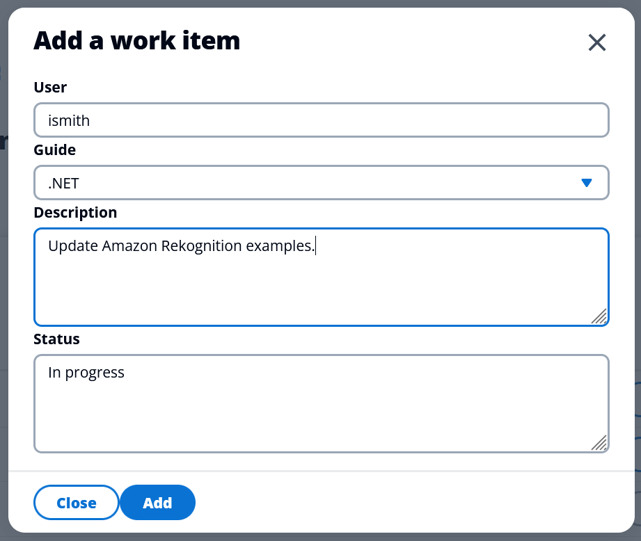
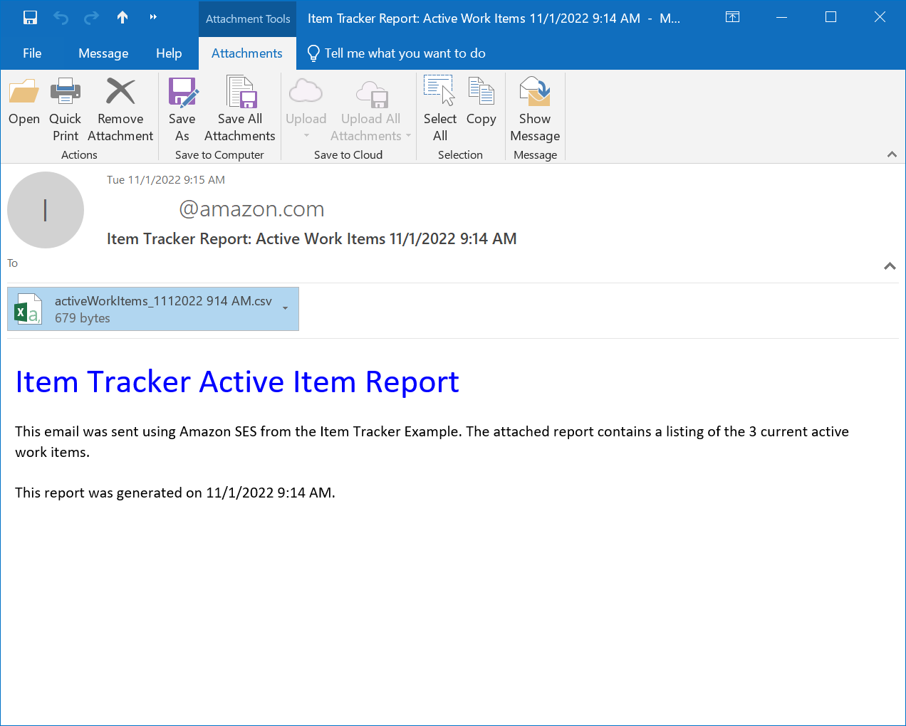
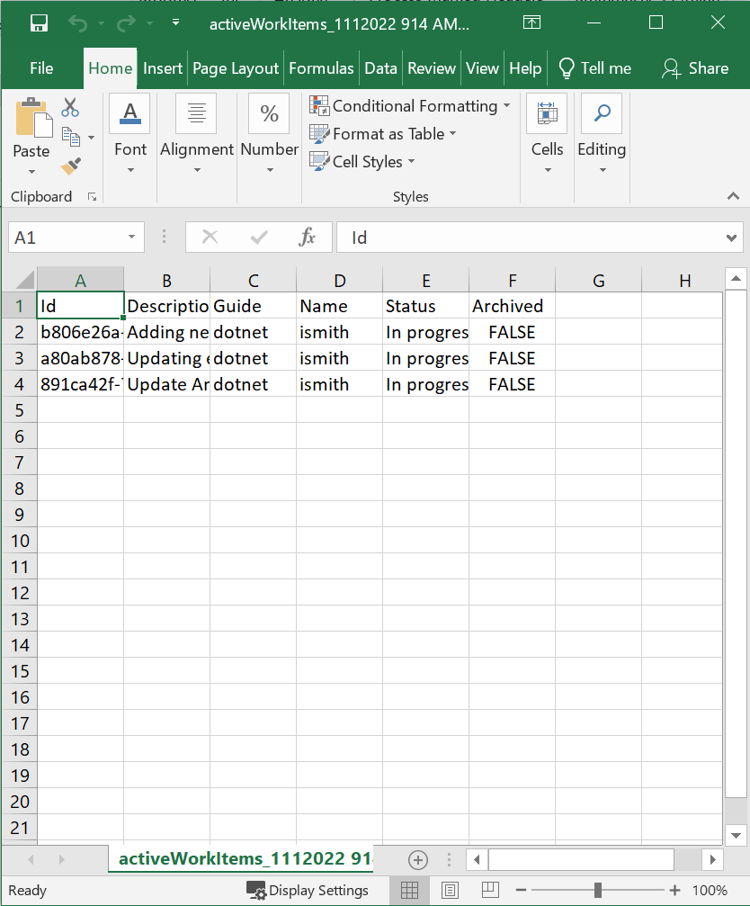

# Tracking work items in an Aurora Serverless database with the SDK for .NET (v3)

## Overview

| Heading      | Description |
| ----------- | ----------- |
| Description | Discusses a REST API that uses the AWS SDK for .NET (v3) to invoke AWS services. The API is called by a React web application that displays the data.   |
| Updated   | 10/31/2022        |

This example shows you how to use the AWS SDK for .NET (v3) to create a REST service that lets you do the following:

* Read, write, and update work items that are stored in an Amazon Aurora Serverless database.
* Use Amazon Simple Email Service (Amazon SES) to send email reports of work items.

This application has two parts: a user interface that uses React.js and a
RESTful API created with C# and .NET 6. The React user interface is a single-page
application (SPA) that interacts with the C# RESTful API by making `GET` and
`POST` requests.

The API uses the [AmazonRDSDataServiceClient](https://docs.aws.amazon.com/sdkfornet/v3/apidocs/items/RDSDataService/TRDSDataServiceClient.html)
object to perform CRUD operations on an Aurora Serverless database. The API
returns JSON data in an HTTP response, as shown in the following illustration.



## Running the example

### ⚠ Important

+ The AWS services used in this project are included in the [AWS Free Tier](https://aws.amazon.com/free/?all-free-tier.sort-by=item.additionalFields.SortRank&all-free-tier.sort-order=asc).
+ This code has not been tested in all AWS Regions. Some AWS services are
  available only in specific Regions. For more information, see [AWS Regional
  Services](https://aws.amazon.com/about-aws/global-infrastructure/regional-product-services). 
+ Running this code might result in charges to your AWS account. 
+ Be sure to delete all of the resources that you create during this tutorial
  so that you won't be charged.

### Prerequisites

To run the code in this example, you need the following:

+ An AWS account.
+ .NET 6
+ To set up your development environment,
see [Setting up your AWS SDK for .NET environment](https://docs.aws.amazon.com/sdk-for-net/v3/developer-guide/net-dg-setup.html). 

### Creating the resources

Using the AWS AWS Cloud Development Kit (AWS CDK), you can set up the resources required for this example. For more information, see [CDK instructions](https://github.com/awsdocs/aws-doc-sdk-examples/tree/main/resources/cdk/aurora_serverless_app/README.md).

### Creating the database table

After you have created the Aurora DB cluster and database, create a table to contain work items. You can do this by using either the AWS Command Line Interface (AWS CLI) or the AWS Management Console.
AWS CLI

Use the AWS CLI to create the work_items table by running the following command at a command prompt. Before you run, replace the following values with the output from the CloudFormation setup script:

- **CLUSTER_ARN** — Replace with the ARN of the Aurora DB cluster, such as arn:aws:rds:us-west-2:123456789012:cluster:doc-example-aurora-app-docexampleauroraappcluster-15xfvaEXAMPLE.
- **SECRET_ARN** — Replace with the ARN of the secret that contains your database credentials, such as arn:aws:secretsmanager:us-west-2:123456789012:secret:docexampleauroraappsecret8B-xI1R8EXAMPLE-hfDaaj.
- **DATABASE** — Replace with the name of the database, such as auroraappdb.

Tip: The caret ^ is the line continuation character for a Windows command prompt. If you run this command on another platform, replace the caret with the line continuation character for that platform.

```
aws rds-data execute-statement ^
    --resource-arn "CLUSTER_ARN" ^
    --database "DATABASE" ^
    --secret-arn "SECRET_ARN" ^
    --sql "CREATE TABLE items (id VARCHAR(45), description VARCHAR(400), guide VARCHAR(45), status VARCHAR(400), name VARCHAR(45), archived BOOLEAN);"
```

## Running the example

To start the React web application, you can download files from the following GitHub repository. Included in this repository are instructions on how to set up the project. Click the following link to access the GitHub location [Item Tracker web client](https://github.com/awsdocs/aws-doc-sdk-examples/tree/main/resources/clients/react/item-tracker/README.md).  

When the web application is running, you will see something like the following.



### Using the Aurora Item Tracker user interface

A user can perform these tasks using the web application:

1. View all items
1. View active items only
1. View archived items only
1. Add a new item
1. Change an active item into an archived item.
1. Send a report as an email attachment

The web application displays *active*, *archived*, or all items. For example, the following illustration shows the React application displaying active data.



Here is the React application displaying archived data.



The user can insert a new item into the **items** table from the user interface in the React front end application. In the following image, you can see the new item form. 



The user can enter an email recipient in the **Email** text field and choose **Send Report**. The recipient will get an email something like the following.



⚠ **Important!** You must update the email **sender** address with a verified email address. Otherwise, the email is not sent. For more information, see [Verifying email addresses in Amazon SES](https://docs.aws.amazon.com/ses/latest/DeveloperGuide/verify-email-addresses.html).       

Active items are selected from the database and used to dynamically create an Excel document. Then, the application uses **Amazon SES** to email the document to the email address entered. The following image shows an example of a report.



For more AWS multiservice examples, see
[usecases](https://github.com/awsdocs/aws-doc-sdk-examples/tree/master/dotnetv3/cross-service).


