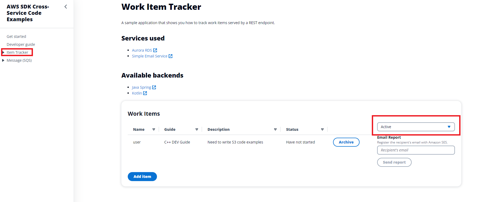
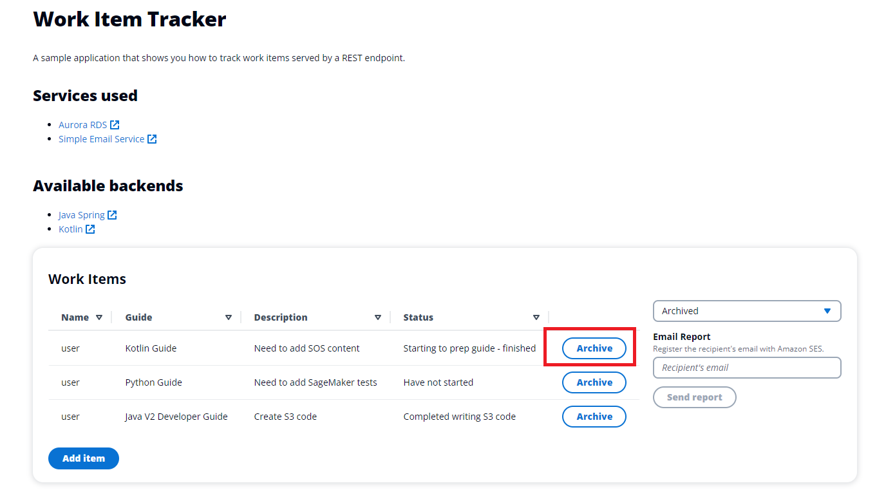
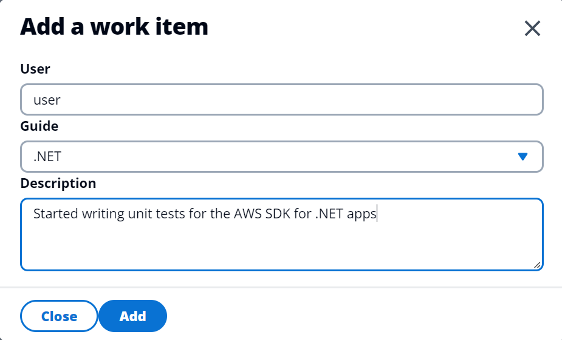
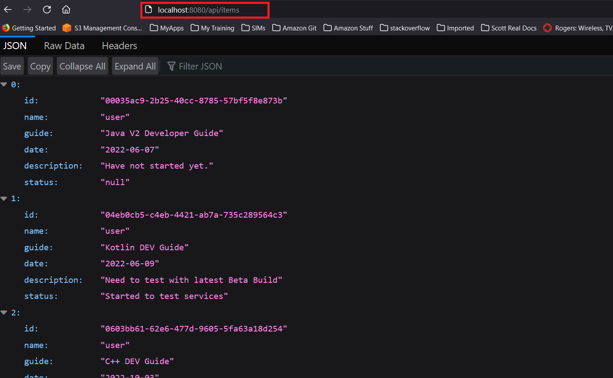

# Creating a Spring Boot application that queries Amazon DynamoDB data

## Overview

| Heading      | Description |
| ----------- | ----------- |
| Description | Discusses how to develop a Spring Boot application that queries Amazon DynamoDB data. The Spring Boot application uses the AWS SDK for Java (v2) to invoke AWS services and is used by a React application that displays the data. The React application uses Cloudscape. For information, see [Cloudscape](https://cloudscape.design/).    |
| Audience   |  Developer (intermediate)        |
| Updated   | 10/24/2022        |
| Required skills   | Java, Maven, JavaScript  |

## Purpose

You can develop a dynamic web application that tracks and reports on work items by using the following AWS services:

+ Amazon DynamoDB
+ Amazon Simple Email Service (Amazon SES). (The SDK for Java (v2) is used to access Amazon SES.)

The application you create is a decoupled React application that uses a Spring REST API to work with Amazon DynamoDB data. That is, the React application is a single-page application (SPA) that interacts with a Spring REST API by making RESTful GET and POST requests. The Spring REST API uses the Amazon DynamoDB Java API to perform CRUD operations on the Amazon DynamoDB database. Then, the Spring REST API returns JSON data in an HTTP response, as shown in the following illustration. 


#### Topics

+ Prerequisites
+ Understand the AWS Tracker application
+ Create an IntelliJ project named ItemTrackerDynamoDBRest
+ Add the Spring POM dependencies to your project
+ Create the Java classes
+ Create the React front end

## Prerequisites

To complete the tutorial, you need the following:

+ An AWS account.
+ A Java IDE to build the Spring REST API. This tutorial uses the IntelliJ IDE.
+ Java JDK 11. (The code in this example uses APIs that are available in JDK 11).
+ Maven 3.6 or later.
+ Set up your development environment. For more information, 
see [Get started with the SDK for Java](https://docs.aws.amazon.com/sdk-for-java/latest/developer-guide/setup.html). 

### Important

+ The AWS services in this document are included in the [AWS Free Tier](https://aws.amazon.com/free/?all-free-tier.sort-by=item.additionalFields.SortRank&all-free-tier.sort-order=asc).
+  This code has not been tested in all AWS Regions. Some AWS services are available only in specific Regions. For more information, see [AWS Regional Services](https://aws.amazon.com/about-aws/global-infrastructure/regional-product-services). 
+ Running this code might result in charges to your AWS account. 
+ Be sure to delete all of the resources that you create during this tutorial so that you won't be charged.

### Creating the DynamoDB table and add some items

Using the AWS Management Console, create an Amazon DynamoDB table named **Work** with a partition key named **id** of type String. 

After creating the **Work** table with the **id** partition key, select the table in the Console. Under
the **Actions** menu, select **Create item** to enter more columns and values (Attributes is the term used with Amazon DynamoDB).

As you are creating an item for the first time, you will both define the attributes in your table as well 
as add values. Enter the attributes and values as shown in the table below. Enter 'Open' as the
value for the **archive** attribute. Select **Create item** to create
your first item (row).

The **Work** table attributes

| Attribute name | What the attribute value represents                                          |
|----------------|------------------------------------------------------------------------------|
| id             | the primary key; enter a random string of text no longer than 20 characters  |
| date           | date the work item was performed                                             |
| description    | description of the work being done                                           |
| guide          | name of the guide the work is for                                            |
| status         | status of the work, e.g., 'started', 'in review'                             |
 | username       | user name who worked performed the work item                                 |
| archive        | a value of 'Open' or 'Closed' to indicate if the work item has been archived |

Enter at least two more items (rows). This time, since you have already defined all the attributes
needed for this example, select the first item you created by activating the item's checkbox, then select
**Duplicate item** under the **Actions** menu. Select **Create item** when you are finished changing the values.

Duplicate one more item so that you have a total of three items.

The following illustration shows an example of the Work table. 


For additional information about how to create an Amazon DynamoDB table using the AWS Management Console 
and how to add data, see [Create a Table](https://docs.aws.amazon.com/amazondynamodb/latest/developerguide/getting-started-step-1.html).
(The table created in that example is different from the one we are using in this example.)

Now that the table is created and populated with some data, when we start up the Spring Boot app for 
the REST API, there will data to display.

## Understand the AWS Tracker React application 

A user can perform the following tasks using the React application:

+ View all active items.
+ View archived items that are complete.
+ Add a new item. 
+ Convert an active item into an archived item.
+ Send a report to an email recipient.

The React application displays *active* and *archive* items. For example, the following illustration shows the React application displaying active data.



Likewise, the following illustration shows the React application displaying archived data.


The React application lets a user convert an active item to an archived item by clicking the following button. 



The React application also lets a user enter a new item. 



The user can enter an email recipient into the **Email Report** text field and choose **Send report**.


Active items are queried from the database and used to dynamically create an Excel document. Then, the application uses Amazon SES to email the document to the selected email recipient. The following image shows an example of a report.


## Create an IntelliJ project named ItemTrackerDynamoDBRest

1. In the IntelliJ IDE, choose **File**, **New**, **Project**.
2. In the **New Project** dialog box, name your project 'ItemTracker', choose **Java** and **Maven**, and then choose **Next**.
3. For **GroupId**, enter **aws-spring**.
4. For **ArtifactId**, enter **ItemTrackerDynamoDBRest**.
6. Choose **Next**.
7. Choose **Finish**.

## Add the POM dependencies to your project

At this point, you have a new project named **ItemTrackerDynamoDBRest**.

**Note:** Make sure to use Java 11 (as shown in the following example).

Confirm that the **pom.xml** file looks like the following example.

```xml
 <?xml version="1.0" encoding="UTF-8"?>
<project xmlns="http://maven.apache.org/POM/4.0.0"
         xmlns:xsi="http://www.w3.org/2001/XMLSchema-instance"
         xsi:schemaLocation="http://maven.apache.org/POM/4.0.0 http://maven.apache.org/xsd/maven-4.0.0.xsd">
    <modelVersion>4.0.0</modelVersion>
    <groupId>ItemTrackerDynamoDB</groupId>
    <artifactId>ItemTrackerDynamoDBRest</artifactId>
    <version>1.0-SNAPSHOT</version>
    <?xml version="1.0" encoding="UTF-8"?>
<project xmlns="http://maven.apache.org/POM/4.0.0"
         xmlns:xsi="http://www.w3.org/2001/XMLSchema-instance"
         xsi:schemaLocation="http://maven.apache.org/POM/4.0.0 http://maven.apache.org/xsd/maven-4.0.0.xsd">
    <modelVersion>4.0.0</modelVersion>
    <groupId>org.example</groupId>
    <artifactId>ItemTrackerDynamoDBRest2</artifactId>
    <version>1.0-SNAPSHOT</version>
    <parent>
        <groupId>org.springframework.boot</groupId>
        <artifactId>spring-boot-starter-parent</artifactId>
        <version>2.7.4</version>
        <relativePath/> <!-- lookup parent from repository -->
    </parent>
    <properties>
        <project.build.sourceEncoding>UTF-8</project.build.sourceEncoding>
        <java.version>11</java.version>
    </properties>
    <dependencyManagement>
        <dependencies>
            <dependency>
                <groupId>software.amazon.awssdk</groupId>
                <artifactId>bom</artifactId>
                <version>2.17.146</version>
                <type>pom</type>
                <scope>import</scope>
            </dependency>
        </dependencies>
    </dependencyManagement>
    <dependencies>
        <dependency>
            <groupId>org.junit.jupiter</groupId>
            <artifactId>junit-jupiter-api</artifactId>
            <version>5.9.0</version>
            <scope>test</scope>
        </dependency>
        <dependency>
            <groupId>org.apache.maven.plugins</groupId>
            <artifactId>maven-clean-plugin</artifactId>
            <version>3.2.0</version>
            <type>maven-plugin</type>
        </dependency>
        <dependency>
            <groupId>org.junit.jupiter</groupId>
            <artifactId>junit-jupiter-engine</artifactId>
            <version>5.9.0</version>
            <scope>test</scope>
        </dependency>
        <dependency>
            <groupId>org.junit.platform</groupId>
            <artifactId>junit-platform-commons</artifactId>
            <version>1.9.0</version>
        </dependency>
        <dependency>
            <groupId>org.junit.platform</groupId>
            <artifactId>junit-platform-launcher</artifactId>
            <version>1.9.0</version>
            <scope>test</scope>
        </dependency>
        <dependency>
            <groupId>software.amazon.awssdk</groupId>
            <artifactId>ses</artifactId>
        </dependency>
        <dependency>
            <groupId>org.assertj</groupId>
            <artifactId>assertj-core</artifactId>
            <version>3.23.1</version>
            <scope>test</scope>
        </dependency>
        <dependency>
            <groupId>software.amazon.awssdk</groupId>
            <artifactId>dynamodb</artifactId>
        </dependency>
        <dependency>
            <groupId>software.amazon.awssdk</groupId>
            <artifactId>dynamodb-enhanced</artifactId>
        </dependency>
        <dependency>
            <groupId>software.amazon.awssdk</groupId>
            <artifactId>protocol-core</artifactId>
        </dependency>
        <dependency>
            <groupId>jakarta.mail</groupId>
            <artifactId>jakarta.mail-api</artifactId>
            <version>2.0.1</version>
        </dependency>
        <dependency>
            <groupId>com.sun.mail</groupId>
            <artifactId>jakarta.mail</artifactId>
            <version>1.6.5</version>
        </dependency>
        <dependency>
            <groupId>mysql</groupId>
            <artifactId>mysql-connector-java</artifactId>
            <scope>runtime</scope>
        </dependency>
        <dependency>
            <groupId>net.sourceforge.jexcelapi</groupId>
            <artifactId>jxl</artifactId>
            <version>2.6.12</version>
        </dependency>
        <dependency>
            <groupId>commons-io</groupId>
            <artifactId>commons-io</artifactId>
            <version>2.6</version>
        </dependency>
        <dependency>
            <groupId>org.springframework.boot</groupId>
            <artifactId>spring-boot-starter-web</artifactId>
        </dependency>
        <dependency>
            <groupId>org.springframework.boot</groupId>
            <artifactId>spring-boot-starter-test</artifactId>
            <scope>test</scope>
            <exclusions>
                <exclusion>
                    <groupId>org.junit.vintage</groupId>
                    <artifactId>junit-vintage-engine</artifactId>
                </exclusion>
            </exclusions>
        </dependency>
        <dependency>
            <groupId>org.springframework.data</groupId>
            <artifactId>spring-data-commons</artifactId>
            <version>2.7.3</version>
        </dependency>
    </dependencies>
    <build>
        <plugins>
            <plugin>
                <groupId>org.springframework.boot</groupId>
                <artifactId>spring-boot-maven-plugin</artifactId>
            </plugin>
           </plugins>
    </build>
</project>
```

## Create the Java classes

Create a Java package in the **main/java** folder named **com.aws.rest**. The following Java files go into this package:

+ **App** - The entry point into the Spring boot application.  
+ **MainController** - Represents the Spring Controller that handles HTTP requests to handle data operations.
+ **ReportController** - Represents a second Spring Controller that handles HTTP requests that generates a report.
+ **DynamoDBService** - Uses the Amazon DynamoDB Java API to perform CRUD operations on the **Work** table. 
+ **WorkItem** - Represents the application's data model.
+ **Work** - Represents the Java class that uses the **@DynamoDbBean** annotation required for the Enhanced Client.  
+ **WriteExcel** - Uses the Java Excel API to dynamically create a report. (This does not use AWS SDK for Java API operations).

### App class 

The following Java code represents the **App** class. This is the entry point into a Spring boot application.  

```java
package com.aws.rest;

import org.springframework.boot.SpringApplication;
import org.springframework.boot.autoconfigure.SpringBootApplication;

@SpringBootApplication
public class App {
        public static void main(String[] args) throws Throwable {
                SpringApplication.run(App.class, args);
        }
}
```    

### MainController class

The following Java code represents the **MainController** class, which handles HTTP requests for the application. Notice the use of the **CrossOrigin** annotation. This annotation lets the controller accept requests from different domains. 

```java
package com.aws.rest;

import org.springframework.beans.factory.annotation.Autowired;
import org.springframework.context.annotation.ComponentScan;
import org.springframework.web.bind.annotation.CrossOrigin;
import org.springframework.web.bind.annotation.GetMapping;
import org.springframework.web.bind.annotation.PathVariable;
import org.springframework.web.bind.annotation.PostMapping;
import org.springframework.web.bind.annotation.PutMapping;
import org.springframework.web.bind.annotation.RequestBody;
import org.springframework.web.bind.annotation.RequestMapping;
import org.springframework.web.bind.annotation.RequestParam;
import org.springframework.web.bind.annotation.RestController;
import java.time.LocalDateTime;
import java.util.List;
import java.util.Map;
import java.util.UUID;
import java.util.stream.Collectors;
import java.util.stream.StreamSupport;

@ComponentScan(basePackages = {"com.aws.rest"})
@CrossOrigin(origins = "*")
@RestController
@RequestMapping("api/items")
public class MainController {
    private final DynamoDBService dbService;

    @Autowired
    MainController(
        DynamoDBService dbService
    ) {
        this.dbService = dbService;
    }

    @GetMapping("" )
    public List<WorkItem> getItems(@RequestParam(required=false) String archived) {
        Iterable<WorkItem> result;
        if (archived != null && archived.compareTo("false")==0)
            result = dbService.getOpenItems();
        else if (archived != null && archived.compareTo("true")==0)
            result = dbService.getClosedItems();
        else
            result = dbService.getAllItems();

        return StreamSupport.stream(result.spliterator(), false)
            .collect(Collectors.toUnmodifiableList());
    }

    @PutMapping("{id}:archive")
    public String modUser(@PathVariable String id) {
        dbService.archiveItemEC(id);
        return id +" was archived";
    }

    @PostMapping("")
    public List<WorkItem> addItem(@RequestBody Map<String, String> payload) {
        String name = payload.get("name");
        String guide = payload.get("guide");
        String description = payload.get("description");
        String status = payload.get("status");

        WorkItem item = new WorkItem();
        String workId = UUID.randomUUID().toString();
        String date = LocalDateTime.now().toString();
        item.setId(workId);
        item.setGuide(guide);
        item.setDescription(description);
        item.setName(name);
        item.setDate(date);
        item.setStatus(status);
        dbService.setItem(item);
        Iterable<WorkItem> result= dbService.getOpenItems();
        return StreamSupport.stream(result.spliterator(), false)
            .collect(Collectors.toUnmodifiableList());
    }
}

```


### DynamoDBService class

The following Java code represents the **DynamoDBService** class. This class uses the Enhanced Client to perform operations on the Amazon DynamoDB **Work** table.  For more information, 
see [Mapping items in DynamoDB tables](https://docs.aws.amazon.com/sdk-for-java/latest/developer-guide/examples-dynamodb-enhanced.html).  

```java
package com.aws.rest;

import software.amazon.awssdk.enhanced.dynamodb.DynamoDbEnhancedClient;
import software.amazon.awssdk.enhanced.dynamodb.DynamoDbTable;
import software.amazon.awssdk.enhanced.dynamodb.Expression;
import software.amazon.awssdk.enhanced.dynamodb.Key;
import software.amazon.awssdk.enhanced.dynamodb.TableSchema;
import software.amazon.awssdk.regions.Region;
import software.amazon.awssdk.services.dynamodb.DynamoDbClient;
import software.amazon.awssdk.enhanced.dynamodb.model.ScanEnhancedRequest;
import java.text.SimpleDateFormat;
import java.util.ArrayList;
import java.util.Calendar;
import java.util.HashMap;
import java.util.Iterator;
import java.util.List;
import java.util.Map;
import org.springframework.stereotype.Component;
import software.amazon.awssdk.services.dynamodb.model.AttributeValue;
import software.amazon.awssdk.services.dynamodb.model.DynamoDbException;

/*
 Before running this code example, create an Amazon DynamoDB table named Work with a primary key named id.
 */
@Component
public class DynamoDBService {

    private DynamoDbClient getClient() {
        Region region = Region.US_EAST_1;
        return DynamoDbClient.builder()
            .region(region)
            .build();
    }
    // Get All items from the DynamoDB table.
    public List<WorkItem> getAllItems() {

        // Create a DynamoDbEnhancedClient.
        DynamoDbEnhancedClient enhancedClient = DynamoDbEnhancedClient.builder()
            .dynamoDbClient(getClient())
            .build();

        try{
            // Create a DynamoDbTable object.
            DynamoDbTable<Work> table = enhancedClient.table("Work", TableSchema.fromBean(Work.class));
            Iterator<Work> results = table.scan().items().iterator();
            WorkItem workItem ;
            ArrayList<WorkItem> itemList = new ArrayList<>();

            while (results.hasNext()) {
                workItem = new WorkItem();
                Work work = results.next();
                workItem.setName(work.getName());
                workItem.setGuide(work.getGuide());
                workItem.setDescription(work.getDescription());
                workItem.setStatus(work.getStatus());
                workItem.setDate(work.getDate());
                workItem.setId(work.getId());

                // Push the workItem to the list.
                itemList.add(workItem);
            }
            return itemList;

        } catch (DynamoDbException e) {
            System.err.println(e.getMessage());
            System.exit(1);
        }
        return null;
    }

    // Archives an item based on the key.
    public void archiveItemEC(String id) {
        try {
            // Create a DynamoDbEnhancedClient.
            DynamoDbEnhancedClient enhancedClient = DynamoDbEnhancedClient.builder()
                .dynamoDbClient(getClient())
                .build();

            DynamoDbTable<Work> workTable = enhancedClient.table("Work", TableSchema.fromBean(Work.class));

            //Get the Key object.
            Key key = Key.builder()
                .partitionValue(id)
                .build();

            // Get the item by using the key.
            Work work = workTable.getItem(r->r.key(key));
            work.setArchive("Closed");

            workTable.updateItem(r->r.item(work));

        } catch (DynamoDbException e) {
            System.err.println(e.getMessage());
            System.exit(1);
        }
    }

    // Get Open items from the DynamoDB table.
    public List<WorkItem> getOpenItems() {

        // Create a DynamoDbEnhancedClient.
        DynamoDbEnhancedClient enhancedClient = DynamoDbEnhancedClient.builder()
            .dynamoDbClient(getClient())
            .build();

        try{
            // Create a DynamoDbTable object.
            DynamoDbTable<Work> table = enhancedClient.table("Work", TableSchema.fromBean(Work.class));
            AttributeValue attr = AttributeValue.builder()
                .s("Open")
                .build();

            Map<String, AttributeValue> myMap = new HashMap<>();
            myMap.put(":val1",attr);

            Map<String, String> myExMap = new HashMap<>();
            myExMap.put("#archive", "archive");

            // Set the Expression so only Closed items are queried from the Work table.
            Expression expression = Expression.builder()
                .expressionValues(myMap)
                .expressionNames(myExMap)
                .expression("#archive = :val1")
                .build();

            ScanEnhancedRequest enhancedRequest = ScanEnhancedRequest.builder()
                .filterExpression(expression)
                .limit(15)
                .build();

            // Scan items.
            Iterator<Work> results = table.scan(enhancedRequest).items().iterator();
            WorkItem workItem ;
            ArrayList<WorkItem> itemList = new ArrayList<>();

            while (results.hasNext()) {
                workItem = new WorkItem();
                Work work = results.next();
                workItem.setName(work.getName());
                workItem.setGuide(work.getGuide());
                workItem.setDescription(work.getDescription());
                workItem.setStatus(work.getStatus());
                workItem.setDate(work.getDate());
                workItem.setId(work.getId());

                // Push the workItem to the list.
                itemList.add(workItem);
            }
            return itemList;

        } catch (DynamoDbException e) {
            System.err.println(e.getMessage());
            System.exit(1);
        }
        return null;
    }

    // Get Closed Items from the DynamoDB table.
    public List< WorkItem > getClosedItems() {

        // Create a DynamoDbEnhancedClient.
        DynamoDbEnhancedClient enhancedClient = DynamoDbEnhancedClient.builder()
            .dynamoDbClient(getClient())
            .build();

        try{
            // Create a DynamoDbTable object.
            DynamoDbTable<Work> table = enhancedClient.table("Work", TableSchema.fromBean(Work.class));

            AttributeValue attr = AttributeValue.builder()
                .s("Closed")
                .build();

            Map<String, AttributeValue> myMap = new HashMap<>();
            myMap.put(":val1",attr);
            Map<String, String> myExMap = new HashMap<>();
            myExMap.put("#archive", "archive");

            // Set the Expression so only Closed items are queried from the Work table.
            Expression expression = Expression.builder()
                .expressionValues(myMap)
                .expressionNames(myExMap)
                .expression("#archive = :val1")
                .build();

            ScanEnhancedRequest enhancedRequest = ScanEnhancedRequest.builder()
                .filterExpression(expression)
                .limit(15)
                .build();

            // Get items.
            Iterator<Work> results = table.scan(enhancedRequest).items().iterator();
            WorkItem workItem ;
            ArrayList<WorkItem> itemList = new ArrayList<>();

            while (results.hasNext()) {
                workItem = new WorkItem();
                Work work = results.next();
                workItem.setName(work.getName());
                workItem.setGuide(work.getGuide());
                workItem.setDescription(work.getDescription());
                workItem.setStatus(work.getStatus());
                workItem.setDate(work.getDate());
                workItem.setId(work.getId());

                //Push the workItem to the list.
                itemList.add(workItem);
            }
            return itemList;

        } catch (DynamoDbException e) {
            System.err.println(e.getMessage());
            System.exit(1);
        }
        return null ;
    }

    public void setItem(WorkItem item) {

        // Create a DynamoDbEnhancedClient.
        DynamoDbEnhancedClient enhancedClient = DynamoDbEnhancedClient.builder()
            .dynamoDbClient(getClient())
            .build();

        putRecord(enhancedClient, item) ;
    }

    // Put an item into a DynamoDB table.
    public void putRecord(DynamoDbEnhancedClient enhancedClient, WorkItem item) {

        try {
            // Create a DynamoDbTable object.
            DynamoDbTable<Work> workTable = enhancedClient.table("Work", TableSchema.fromBean(Work.class));
            String myGuid = java.util.UUID.randomUUID().toString();
            Work record = new Work();
            record.setUsername(item.getName());
            record.setId(myGuid);
            record.setDescription(item.getDescription());
            record.setDate(now()) ;
            record.setStatus(item.getStatus());
            record.setArchive("Open");
            record.setGuide(item.getGuide());
            workTable.putItem(record);

        } catch (DynamoDbException e) {
            System.err.println(e.getMessage());
            System.exit(1);
        }
    }

    private String now() {
        String dateFormatNow = "yyyy-MM-dd HH:mm:ss";
        Calendar cal = Calendar.getInstance();
        SimpleDateFormat sdf = new SimpleDateFormat(dateFormatNow);
        return sdf.format(cal.getTime());
    }
}
```

### WorkItem class

The following Java code represents the **WorkItem** class.   

```java
    package com.aws.rest;

public class WorkItem {

    private String id;
    private String name;
    private String guide ;
    private String date;
    private String description;
    private String status;

    public void setId (String id) {
                this.id = id;
        }

    public String getId() {
                return this.id;
        }

    public void setStatus (String status) {
                this.status = status;
        }

    public String getStatus() {
                return this.status;
        }

    public void setDescription (String description) {
                this.description = description;
        }

    public String getDescription() {
                return this.description;
        }

    public void setDate (String date) {
                this.date = date;
        }

    public String getDate() {
                return this.date;
        }

    public void setName (String name) {
                this.name = name;
        }

    public String getName() {
                return this.name;
        }

    public void setGuide (String guide) {
                this.guide = guide;
        }

    public String getGuide() {
                return this.guide;
        }
}
```
### Work class

The following class represents the **Work** class that uses the **@DynamoDbBean** annotation required for the Enhanced Client.

```java
 package com.aws.rest;

import software.amazon.awssdk.enhanced.dynamodb.mapper.annotations.DynamoDbSortKey;
import software.amazon.awssdk.enhanced.dynamodb.mapper.annotations.DynamoDbBean;
import software.amazon.awssdk.enhanced.dynamodb.mapper.annotations.DynamoDbPartitionKey;

@DynamoDbBean
public class Work {
    private String id;
    private String date;
    private String description ;
    private String guide;
    private String username ;
    private String status ;
    private String archive ;

    @DynamoDbPartitionKey
    public String getId() {
        return this.id;
    };

    public void setId(String id) {
        this.id = id;
    }

    @DynamoDbSortKey
    public String getName() {
        return this.username;
    }

    public void setArchive(String archive) {
        this.archive = archive;
    }

    public String getArchive() {
        return this.archive;
    }

    public void setStatus(String status) {
        this.status = status;
    }

    public String getStatus() {
        return this.status;
    }

    public void setUsername(String username) {
        this.username = username;
    }

    public String getUsername() {
        return this.username;
    }

    public void setGuide(String guide) {
        this.guide = guide;
    }

    public String getGuide() {
        return this.guide;
    }

    public String getDate() {
        return this.date;
    }

    public void setDate(String date) {
        this.date = date;
    }

    public String getDescription() {
        return description;
    }

    public void setDescription(String description) {
        this.description = description;
    }
}

```


### WriteExcel class

The **WriteExcel** class dynamically creates an Excel report with the data marked as active. The following code represents this class.

```java
 package com.aws.rest;

import jxl.CellView;
import jxl.Workbook;
import jxl.WorkbookSettings;
import jxl.format.UnderlineStyle;
import jxl.write.Label;
import jxl.write.WritableCellFormat;
import jxl.write.WritableFont;
import jxl.write.WritableSheet;
import jxl.write.WritableWorkbook;
import jxl.write.WriteException;
import org.apache.commons.io.IOUtils;
import org.springframework.stereotype.Component;
import software.amazon.awssdk.core.SdkBytes;
import software.amazon.awssdk.regions.Region;
import software.amazon.awssdk.services.ses.SesClient;
import software.amazon.awssdk.services.ses.model.RawMessage;
import software.amazon.awssdk.services.ses.model.SendRawEmailRequest;
import software.amazon.awssdk.services.ses.model.SesException;
import javax.activation.DataHandler;
import javax.activation.DataSource;
import javax.mail.Message;
import javax.mail.MessagingException;
import javax.mail.Session;
import javax.mail.internet.InternetAddress;
import javax.mail.internet.MimeBodyPart;
import javax.mail.internet.MimeMessage;
import javax.mail.internet.MimeMultipart;
import javax.mail.util.ByteArrayDataSource;
import java.io.ByteArrayInputStream;
import java.io.ByteArrayOutputStream;
import java.io.IOException;
import java.io.InputStream;
import java.nio.ByteBuffer;
import java.util.Locale;
import java.util.Properties;

@Component
public class WriteExcel {
    static WritableCellFormat times ;
    static WritableCellFormat timesBoldUnderline;

    static {
        try {
            WritableFont times10pt = new WritableFont(WritableFont.TIMES, 10);
            times = new WritableCellFormat(times10pt);
            times.setWrap(true);

            WritableFont times10ptBoldUnderline = new WritableFont(WritableFont.TIMES, 10, WritableFont.BOLD, false, UnderlineStyle.SINGLE);
            timesBoldUnderline = new WritableCellFormat(times10ptBoldUnderline);
            timesBoldUnderline.setWrap(true);
        } catch (WriteException e) {
            e.printStackTrace();
        }
    }

    public InputStream write(Iterable<WorkItem> items) throws IOException, WriteException {
        ByteArrayOutputStream os = new ByteArrayOutputStream();
        WorkbookSettings wbSettings = new WorkbookSettings();
        wbSettings.setLocale(new Locale("en", "US"));

        WritableWorkbook workbook = Workbook.createWorkbook(os, wbSettings);
        workbook.createSheet("Work Item Report", 0);
        WritableSheet excelSheet = workbook.getSheet(0);

        addLabels(excelSheet);
        fillContent(excelSheet, items);

        workbook.write();
        workbook.close();

        return new ByteArrayInputStream(os.toByteArray());
    }

    private void addLabels(WritableSheet sheet) throws WriteException {
        CellView cv = new CellView();
        cv.setFormat(timesBoldUnderline);
        cv.setAutosize(true);

        addCaption(sheet, 0, 0, "Writer");
        addCaption(sheet, 1, 0, "Date");
        addCaption(sheet, 2, 0, "Guide");
        addCaption(sheet, 3, 0, "Description");
        addCaption(sheet, 4, 0, "Status");
    }

    private void addCaption(WritableSheet sheet, int column, int row, String s) throws WriteException {
        Label label = new Label(column, row, s, timesBoldUnderline);
        int cc = s.length();
        sheet.setColumnView(column, cc);
        sheet.addCell(label);
    }

    private void addField(WritableSheet sheet, int column, int row, String s) throws WriteException {
        Label label = new Label(column, row, s, timesBoldUnderline);
        int cc = s.length();
        cc = cc > 200 ? 150 : cc + 6;
        sheet.setColumnView(column, cc);
        sheet.addCell(label);
    }

    private void fillContent(WritableSheet sheet, Iterable<WorkItem> items) throws WriteException {
        int row = 2;
        for (WorkItem item : items) {
            addField(sheet, 0, row, item.getName());
            addField(sheet, 1, row, item.getDate());
            addField(sheet, 2, row, item.getGuide());
            addField(sheet, 3, row, item.getDescription());
            addField(sheet, 4, row, item.getStatus());
            row += 1;
        }
    }

    @Component
    public static class SendMessages {
        private static String sender = "scmacdon@amazon.com";
        private static String subject = "Weekly AWS Status Report";
        private static String bodyText = "Hello,\r\n\r\nPlease see the attached file for a weekly update.";
        private static String bodyHTML = "<!DOCTYPE html><html lang=\"en-US\"><body><h1>Hello!</h1><p>Please see the attached file for a weekly update.</p></body></html>";
        private static String attachmentName = "WorkReport.xls";

        public void sendReport(InputStream is, String emailAddress) throws IOException {
            byte[] fileContent = IOUtils.toByteArray(is);

            try {
                send(makeEmail(fileContent, emailAddress));
            } catch (MessagingException e) {
                e.printStackTrace();
            }
        }

        public void send(MimeMessage message) throws MessagingException, IOException {
            ByteArrayOutputStream outputStream = new ByteArrayOutputStream();
            message.writeTo(outputStream);
            ByteBuffer buf = ByteBuffer.wrap(outputStream.toByteArray());
            byte[] arr = new byte[buf.remaining()];
            buf.get(arr);
            SdkBytes data = SdkBytes.fromByteArray(arr);
            RawMessage rawMessage = RawMessage.builder().data(data).build();
            SendRawEmailRequest rawEmailRequest = SendRawEmailRequest.builder().rawMessage(rawMessage).build();

            try {
                System.out.println("Attempting to send an email through Amazon SES...");
                SesClient client = SesClient.builder().region(Region.US_WEST_2).build();
                client.sendRawEmail(rawEmailRequest);
            } catch (SesException e) {
                e.printStackTrace();
            }
        }

        private MimeMessage makeEmail(byte[] attachment, String emailAddress) throws MessagingException {
            Session session = Session.getDefaultInstance(new Properties());
            MimeMessage message = new MimeMessage(session);

            message.setSubject(subject, "UTF-8");
            message.setFrom(new InternetAddress(sender));
            message.setRecipients(Message.RecipientType.TO, InternetAddress.parse(emailAddress));

            MimeBodyPart textPart = new MimeBodyPart();
            textPart.setContent(bodyText, "text/plain; charset=UTF-8");

            MimeBodyPart htmlPart = new MimeBodyPart();
            htmlPart.setContent(bodyHTML, "text/html; charset=UTF-8");

            MimeMultipart msgBody = new MimeMultipart("alternative");
            msgBody.addBodyPart(textPart);
            msgBody.addBodyPart(htmlPart);

            MimeBodyPart wrap = new MimeBodyPart();
            wrap.setContent(msgBody);

            MimeMultipart msg = new MimeMultipart("mixed");
            msg.addBodyPart(wrap);

            MimeBodyPart att = new MimeBodyPart();
            DataSource fds = new ByteArrayDataSource(attachment, "application/vnc.openxmlformats-officedocument.spreadsheetml.sheet");
            att.setDataHandler(new DataHandler(fds));
            att.setFileName(attachmentName);

            msg.addBodyPart(att);
            message.setContent(msg);
            return message;
        }
    }
}
```

**Note:** You must update the email **sender** address with a verified email address. Otherwise, the email is not sent. For more information, see [Verifying email addresses in Amazon SES](https://docs.aws.amazon.com/ses/latest/DeveloperGuide/verify-email-addresses.html).       

## Run the application 

Using the IntelliJ IDE, you can run your Spring REST API. The first time you run it, choose the run icon in the main class. The Spring API supports the following URLs. 

- /api/items - A GET request that returns all data items from the **Work** table. 
- /api/items?archived=true - A GET request that returns either active or archive data items from the **Work** table. 
- /api/items/{id}:archive - A PUT request that converts the specified data item to an archived item. 
- /api/items - A POST request that adds a new item to the database. 
- api/items:report - A POST request that creates a report of active items and emails the report. 

**Note**: The React application created in the next section consumes all of these URLs. 

Confirm that the Spring REST API works by viewing the Active items. Enter the following URL into a browser. 

http://localhost:8080/api/items

The following illustration shows the JSON data returned from the Spring REST API. 



## Create the React front end

You can create the React application that consumes the JSON data returned from the Spring REST API. To create the React application, you can download files from the following GitHub repository. Included in this repository are instructions on how to set up the project. Click the following link to access the GitHub location [Work item tracker web client](https://github.com/awsdocs/aws-doc-sdk-examples/tree/main/resources/clients/react/elwing).  

### Update BASE_URL

You must ensure that the **BASE_URL** is correct. In the **config.json** file, ensure this value references your Spring application.

```javascript
{
  "BASE_URL": "http://localhost:8080/api"
}
```
  
### Next steps
Congratulations, you have created a decoupled React application that consumes data from a Spring Boot application. The Spring Boot application uses the AWS SDK for Java (v2) to invoke AWS services. As stated at the beginning of this tutorial, be sure to delete all of the resources that you create during this tutorial so that you won't continue to be charged.

For more AWS multiservice examples, see
[usecases](https://github.com/awsdocs/aws-doc-sdk-examples/tree/master/javav2/usecases).


